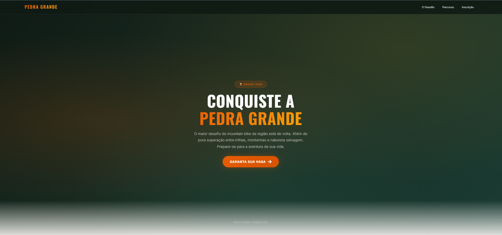
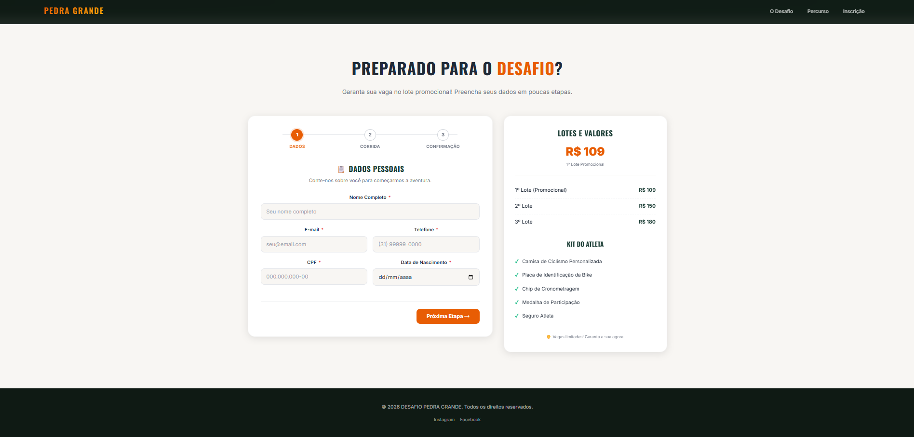
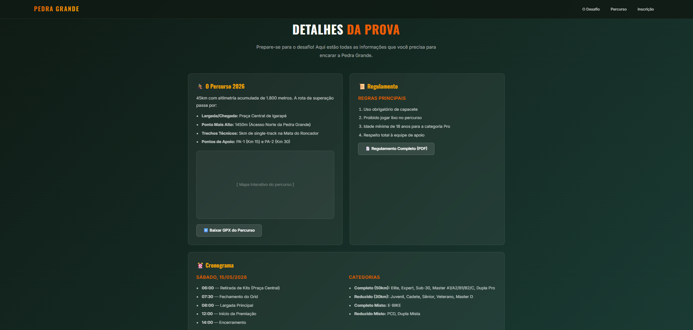

# 🚵 DESAFIO PEDRA GRANDE

Sistema de inscrição para o **Desafio Pedra Grande** — o maior desafio de mountain bike da região.

## 🎯 Sobre o Projeto

Plataforma web completa para gerenciamento de inscrições do evento, com formulário multi-etapas, cálculo automático de categoria por idade/sexo e integração com PagBank para pagamentos.

## 🎨 Layout


*Hero section com chamada para ação*


*Formulário de inscrição em 3 etapas com indicador de progresso*


*Seção com percurso, regulamento e cronograma*

### Formulário Multi-Etapas
- **Etapa 1** — Dados pessoais (nome, email, telefone, CPF, data de nascimento)
- **Etapa 2** — Dados da corrida (sexo, percurso, categoria com seleção dinâmica)
- **Etapa 3** — Revisão e confirmação dos dados antes do pagamento

### Seções do Site
- **Nossa História** — Cards com a filosofia do evento
- **Detalhes da Prova** — Percurso, regulamento e cronograma
- **Inscrição** — Formulário + sidebar com lotes e kit do atleta

## 🛠️ Stack

| Tecnologia | Versão |
|------------|--------|
| Laravel | ^12.0 |
| PHP | ^8.2 |
| MySQL | 8.0 |
| Vite | ^7.0 |
| TailwindCSS | ^4.0 |
| PagBank API | Sandbox |

## 🚀 Como Rodar Localmente

```bash
# Terminal 1 - Backend
php artisan serve

# Terminal 2 - Frontend (CSS/JS)
npm run dev
```

Acesse: `http://127.0.0.1:8000`

## 📦 Funcionalidades

- ✅ Formulário de inscrição em 3 etapas
- ✅ 25 categorias com regras dinâmicas (idade + sexo + percurso)
- ✅ Cálculo automático de idade (ano base 2026)
- ✅ Integração PagBank (checkout, PIX, boleto, cartão)
- ✅ Webhook para atualização de status de pagamento
- ✅ Banco de dados MySQL
- ✅ Design responsivo e tema aventura
- ✅ Indicador de progresso no formulário

## 🏔️ Categorias

| Percurso | Categorias |
|----------|-----------|
| Completo (50km) | Elite, Expert, Sub-30, Master A1/A2/B1/B2/C, Dupla Pro, Peso Pesado |
| Reduzido (30km) | Juvenil, Cadete, Sênior, Veterano, Master D |
| Completo Misto | E-BIKE |
| Reduzido Misto | PCD, Dupla Mista |

## 🔒 Segurança

- Validação server-side dos dados
- CSRF Protection (exceto webhook)
- Senhas e tokens em `.env` (ignorado pelo Git)
- Dados limpos antes de enviar a terceiros

## 📄 Licença

MIT
